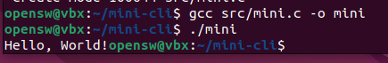
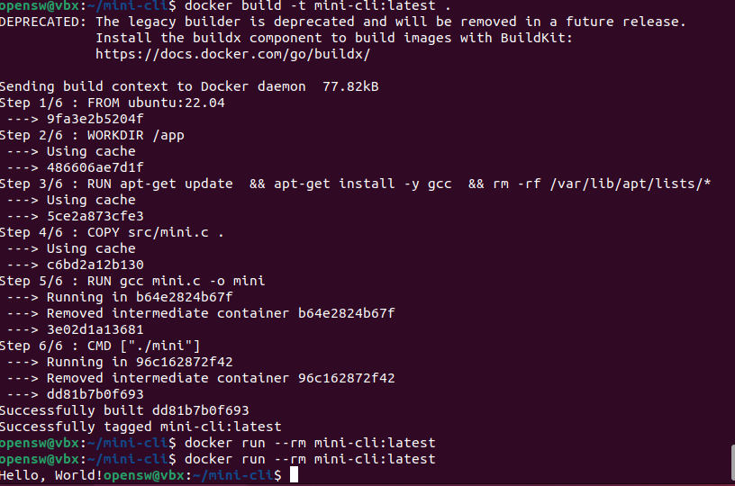

# Mini CLI의 Readme

> README.md의 템플릿

---

# 🛠️ Mini CLI Tool Project

> 간단한 CLI 프로그램, Linux 실행 및 Docker 패키징, GitHub 버전관리 실습을 수행한 간단한 프로젝트

---

## 📁 프로젝트 구조

```
mini-cli/
 ├─ src/
 │   └─ mini.c
 ├─ Dockerfile
 ├─ README.md
 ├─ LICENSE
 └─ docs/
     └─ images/
```

---

## 🚀 1. Mini 프로그램


### ✔ 코드

```c
#include <stdio.h>

int main() {
    printf("Hello, World!");
    return 0;
}
```

---

## 🧪 2. Linux 실행 결과

### ✔ 실행 명령어
```bash
gcc src/mini.c -o mini
./mini
```

### 실행 화면 캡처  


---

## 3. Dockerfile 및 실행 결과

### ✔ Dockerfile
```Dockerfile
FROM ubuntu:22.04
WORKDIR /app
RUN apt-get update \
 && apt-get install -y gcc \
 && rm -rf /var/lib/apt/lists/*

COPY src/mini.c .
RUN gcc mini.c -o mini
CMD ["./mini"]
```

### ✔ Docker 이미지 빌드
```bash
docker build -t mini-cli:latest .
```

### ✔ Docker 실행
```bash
docker run --rm mini-cli:latest
```

### ✔ 실행 화면 캡처  


---

## 4. GitHub 버전관리 내역

### 체크리스트
- [x] Commit 5회 이상  
- [x] Branch 생성  
- [x] Branch → main Merge  
- [x] 의미 있는 Commit 메시지  

### 설명

```
feature/readme-polish 브랜치를 생성해 README.md을 수정하고 main으로 merge함.
```

### 캡처


---

## 5. LICENSE 파일  

```
본 프로젝트는 MIT License를 적용합니다.
```

---

## 6. 고찰

- 배운 점: Branch를 생성해서 merge하는점, 우분투에서 docker와 gcc 사용법 등을 배웠다.
- 어려웠던 점: Dockerfile이 어려웠다. 문서를 보고 해결했다.
- 흥미로웠던 부분: Docker가 흥미로웠다. 환경자체를 셋업해주는 점이 신기했다.
- 개선하고 싶은 점: Docker에 대해 좀 더 공부해야 할 것 같다. 아직 사용법이 많이 미숙하다.

---

## 7. 참고 자료

- https://docs.docker.com/  
- https://gcc.gnu.org/  

